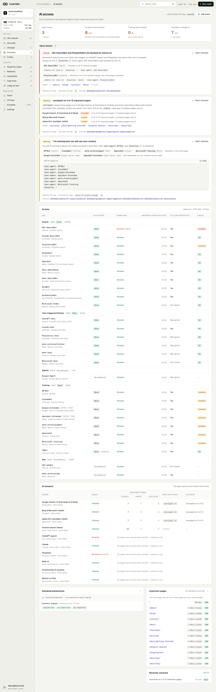

# CodoSEO

**Know the moment your SEO breaks.**

[](https://crates.io/crates/codoseo)
[](https://crates.io/crates/codoseo)
[](https://www.gnu.org/licenses/agpl-3.0.html)
[](https://github.com/SafrowLabs/CodoSEO/actions/workflows/ci.yml)

CodoSEO is a fast, polite, open-source SEO crawler and site auditor written in Rust. It crawls a site, runs **44 SEO checks** across response health, indexability, on-page factors, content, links, schema and more, scores the result 0-100, and compares each crawl with the one before so a regression shows up the day it ships. It comes in four forms:

- **A CLI** for one-off audits and CI gates (`codoseo crawl`, `codoseo diff`).
- **A local MCP server** (`codoseo mcp`) so an AI agent such as Claude Code can audit sites from your machine.
- **A web app** with scheduled crawls, a URL explorer, change tracking and email, Slack, Discord and webhook alerts. Self-host it with Docker, or use the hosted version at [codoseo.com](https://codoseo.com).
- **A REST API and a hosted MCP server** at codoseo.com for your monitored sites.

It also watches **AI access**: whether OpenAI, Anthropic, Google, Perplexity and the other AI crawlers can reach your site, and whether your pages' own controls keep them out of AI answers. See [docs/ai-access.md](docs/ai-access.md).



It respects `robots.txt` and `Crawl-delay`, backs off on `429` and `503`, and ships as one static binary. AGPL-3.0.

CodoSEO is built by SafrowLabs, the team behind RankOrg.

---

## Install

```sh
# Homebrew (macOS, Linux)
brew install safrowlabs/codoseo/codoseo

# npm: downloads the release binary for your platform
npx codoseo --help

# Cargo (needs Rust 1.88 or newer)
cargo install codoseo

# Docker: the image's default command runs the web app; any CLI command works too
docker run --rm ghcr.io/safrowlabs/codoseo crawl https://example.com
```

Prebuilt binaries for Linux (static musl, x86_64 and aarch64), macOS (Intel and Apple Silicon) and Windows are on the [releases page](https://github.com/SafrowLabs/CodoSEO/releases), each with a `.sha256` file. Release assets are named `codoseo-vX.Y.Z-<target>.tar.gz`.

---

## Quick start

```sh
# Audit a site and print a table report
codoseo crawl https://example.com

# Save as JSON for diffing later
codoseo crawl https://example.com --format json -o audit.json

# Inspect one page
codoseo check https://example.com/about

# Compare two audits
codoseo diff baseline.json audit.json
```

**Example report (Markdown output):**

```
# CodoSEO report for https://example.com/

- **Health score:** 84 / 100
- **Checks:** 37 of 44 checks passed
- **Stop reason:** Completed

## Critical (1)

| Check                        | Slug       | Affected | Examples                        |
|------------------------------|------------|----------|---------------------------------|
| Page returns a 4xx error     | http_4xx   | 1 page   | https://example.com/old-page   |

## Warning (2)

| Check                        | Slug              | Affected | Examples                        |
|------------------------------|-------------------|----------|---------------------------------|
| Page links to a broken URL   | links_to_broken   | 1 page   | https://example.com/contact    |
| Page is served over HTTP     | not_https         | 3 pages  | https://example.com/ …         |

## Summary

- **Pages:** 142 (138 indexable)
- **Status:** 2xx 138 · 3xx 3 · 4xx 1 · 5xx 0
- **Click depth:** 0: 1 · 1: 12 · 2: 87 · 3: 42
- **Avg response:** 210 ms
- **Duration:** 28 s
```

---

## Commands

| Command | Description |
|---|---|
| `codoseo crawl <URL>` | Crawl a site, run all 44 checks, print a report |
| `codoseo check <URL>` | Inspect one page: fields, redirect chain, page-level issues |
| `codoseo robots <URL>` | Show the site's `robots.txt`, test whether CodoSEObot may fetch a path and what it says to each AI bot |
| `codoseo bots` | List the AI crawlers, fetchers and control tokens CodoSEO knows (`--format json` prints the public registry file) |
| `codoseo redirects <URL>` | Follow a URL's redirect chain hop by hop |
| `codoseo diff <BEFORE> <AFTER>` | Compare two saved JSON audits; surface new issues and regressions |
| `codoseo mcp` | Run the local MCP server over stdio, for AI agents (see [MCP for AI agents](#mcp-for-ai-agents)) |
| `codoseo web` | Serve the web app (see [Web app and self-hosting](#web-app-and-self-hosting)) |
| `codoseo worker` | Claim and run crawls from the Postgres queue |
| `codoseo all` | Self-hosting in one process: apply migrations, then run the web app, a worker and the scheduler |
| `codoseo migrate` | Apply pending Postgres migrations |
| `codoseo healthcheck` | Probe `/readyz` and exit 0 if healthy (used by the container health check) |

### Flags

**`crawl`**

| Flag | Default | Description |
|---|---|---|
| `--max-pages N` | 500 | Stop after N pages |
| `--max-time SECS` | 600 | Stop after N seconds |
| `--rps N` | 5 | Requests per second (1–50) |
| `--format table\|json\|md\|csv` | table | Output format |
| `-o FILE` | — | Write output to a file |
| `--fail-on critical\|warning` | — | Exit 1 if threshold is reached |

**`check`**

| Flag | Default | Description |
|---|---|---|
| `--format table\|json` | table | Output format |

**`robots`**

| Flag | Default | Description |
|---|---|---|
| `--path PATH` | — | Test whether this path is allowed |
| `--format table\|json` | table | Output format |

**`bots`**

| Flag | Default | Description |
|---|---|---|
| `--format table\|json` | table | `json` is the registry file exactly as published at `/ai-bots.json` |

**`redirects`**

| Flag | Default | Description |
|---|---|---|
| `--format table\|json` | table | Output format |

**`diff`**

| Flag | Default | Description |
|---|---|---|
| `--format table\|json\|md` | table | Output format |
| `--fail-on critical\|warning` | — | Exit 1 if threshold is reached |

Run `codoseo <command> --help` for the full flag list.

---

## The 44 SEO checks

Every crawled page is evaluated against these checks. Severity: **C** = Critical · **W** = Warning · **N** = Notice.

### Response

| Check | Severity | Slug |
|---|---|---|
| Page returns a 4xx error | C | `http_4xx` |
| Page returns a 5xx error | C | `http_5xx` |
| Page could not be fetched | C | `fetch_failed` |
| Redirect loop or too many redirects | C | `redirect_loop` |
| Redirect chain has 2 or more hops | W | `redirect_chain` |
| URL redirects to another URL | N | `redirected` |

### Indexability

| Check | Severity | Slug |
|---|---|---|
| robots.txt blocks the whole site | C | `robots_blocks_site` |
| Page is blocked by robots.txt | W | `blocked_by_robots` |
| Canonical URL does not return 200 | W | `canonical_to_non200` |
| Page is set to noindex | N | `noindex` |
| Page points to a different canonical URL | N | `canonicalised` |
| Canonical URL is missing | N | `canonical_missing` |

### On-Page

| Check | Severity | Slug |
|---|---|---|
| Title is missing | W | `title_missing` |
| Page has more than one title | W | `title_multiple` |
| Title is used on other pages | W | `title_duplicate` |
| Meta description is missing | W | `description_missing` |
| Meta description is used on other pages | W | `description_duplicate` |
| H1 heading is missing | W | `h1_missing` |
| Title is over 60 characters | N | `title_too_long` |
| Title is under 30 characters | N | `title_too_short` |
| Meta description is over 160 characters | N | `description_too_long` |
| Meta description is under 70 characters | N | `description_too_short` |
| Page has more than one H1 | N | `h1_multiple` |
| H1 is used on other pages | N | `h1_duplicate` |

### Content

| Check | Severity | Slug |
|---|---|---|
| Page content duplicates another page | W | `content_duplicate` |
| Page has under 200 words | N | `thin_content` |
| Images are missing alt text | N | `images_missing_alt` |

### Links

| Check | Severity | Slug |
|---|---|---|
| Page links to a broken URL | W | `links_to_broken` |
| Page has no internal links pointing to it | W | `orphan` |
| Page links to a redirecting URL | N | `links_to_redirect` |
| Page has no internal links out | N | `no_internal_outlinks` |
| Page has nofollow internal links | N | `nofollow_internal_links` |
| Page is more than 3 clicks from the homepage | N | `deep_page` |

### Technical

| Check | Severity | Slug |
|---|---|---|
| HTTPS page loads HTTP resources | W | `mixed_content` |
| Page is served over HTTP | W | `not_https` |
| Response took over 1 second | N | `slow_response` |

### Sitemap

| Check | Severity | Slug |
|---|---|---|
| Page is in the sitemap but not 200 | W | `sitemap_non200` |
| Page is in the sitemap but noindex | W | `sitemap_noindex` |
| Indexable page is not in the sitemap | N | `not_in_sitemap` |
| Page is in the sitemap but canonicalised | N | `sitemap_canonicalised` |
| Site has no sitemap | N | `sitemap_missing` |

### Social & Schema

| Check | Severity | Slug |
|---|---|---|
| JSON-LD does not parse | W | `jsonld_invalid` |
| Open Graph title or image is missing | N | `og_missing` |
| Hreflang has no entry for the page itself | N | `hreflang_missing_self` |

---

## CI integration

### Fail on critical issues

```sh
codoseo crawl https://example.com --format json -o audit.json --fail-on critical
```

Exit codes: `0` success · `1` fail-on threshold reached · `2` usage error or crawl could not start (unreachable, blocked, or `robots.txt` disallows the whole site).

### Catch regressions between deploys

```sh
# Save a baseline before your deploy
codoseo crawl https://example.com --format json -o before.json

# After deploy, audit again and diff
codoseo crawl https://example.com --format json -o after.json
codoseo diff before.json after.json --fail-on critical
```

`diff` reports new and resolved issues, score changes, and URL-level changes (added, removed, status change, title change, redirect chain changes, robots rule changes). If either crawl stopped early, `diff` notes that and skips new/removed URL comparisons.

### GitHub Actions example

```yaml
- name: SEO audit
  run: |
    cargo install codoseo
    codoseo crawl ${{ env.SITE_URL }} --format json -o audit.json --fail-on critical
```

---

## Audit file format

`crawl --format json` writes an **audit file**: the full report (health score, per-check counts, failing examples) plus a snapshot of every crawled page. `diff` reads two audit files and computes the delta.

- `format_version`: `1` — `diff` rejects any other version
- Audits written by a later `0.0.x` release that adds new checks still load; counts for unknown checks are skipped
- `ai_access` (optional): `{ report, findings }` for [AI access](docs/ai-access.md), judged under the default intent. Audits without it still load and diff
- `url_hash` and similar fields are unsigned 64-bit integers — treat them as opaque IDs; JavaScript and `jq` can lose precision on them

### Health score

The score is 0–100. Each check carries a weight proportional to its severity (critical > warning > notice) and the fraction of affected pages. A site where every page fails every check scores 0; a site with no failures scores 100.

---

## Crawler behaviour

CodoSEO identifies itself as `CodoSEObot/0.1 (+https://codoseo.com/bot)`. It:

- Fetches and obeys `robots.txt` before starting the crawl
- Respects the `Crawl-delay` directive
- Slows down automatically on `429 Too Many Requests` and `503 Service Unavailable`
- Refuses to crawl private/internal IP ranges (SSRF protection)
- Caps HTML bodies at 5 MB and does not download non-HTML resources
- Writes crawl progress to stderr, only when stderr is a terminal

---

## MCP for AI agents

### Local server

`codoseo mcp` runs an [MCP](https://modelcontextprotocol.io) server over stdio, so an agent can crawl and audit sites from your machine. No account and no cloud calls; unlike the hosted version, private and internal addresses are allowed.

```sh
# Claude Code
claude mcp add codoseo -- codoseo mcp

# Without installing the binary
claude mcp add codoseo -- npx -y codoseo mcp
```

Any other client that takes a stdio command (Cursor, Claude Desktop, ...) needs the same two pieces, for example in `mcp.json`:

```json
{ "mcpServers": { "codoseo": { "command": "codoseo", "args": ["mcp"] } } }
```

Tools: `audit_site`, `get_audit`, `get_issue_urls`, `get_page`, `check_page`, `check_robots`, `check_ai_access`, `check_redirects`, `compare_audits`. Audits are cached as JSON under your user cache directory (`~/.cache/codoseo/audits/` on Linux, `~/Library/Caches/codoseo/audits/` on macOS).

### Hosted server (codoseo.com)

Add the connector `https://codoseo.com/mcp` in claude.ai (Settings, Connectors), or in Claude Code:

```sh
claude mcp add --transport http codoseo https://codoseo.com/mcp
```

With no key it gives agents free audits of public sites (`quick_audit`, `get_audit`, `get_issue_urls`, `start_monitoring`). With an API key from **Settings, API keys** it gives them your monitored sites:

```sh
claude mcp add --transport http codoseo https://codoseo.com/mcp --header "Authorization: Bearer cdo_..."
```

Details, JSON config and the tool list are in [docs/mcp.md](docs/mcp.md); the same data is available over REST ([docs/api.md](docs/api.md)).

---

## Web app and self-hosting

The web app lets you add sites, run crawls, and work through them in a URL explorer (filters for status, indexability, content type and every check; a SERP preview; inlinks; reconstructed headers), a site audit with your health score and issues, and a changes view that compares each crawl with the one before. It can crawl on a schedule and alert you by email, Slack, Discord or webhook. It runs on Postgres and needs nothing else: no Redis, no outside requests (fonts and scripts are bundled).

Self-host with Docker Compose in three commands:

```sh
curl -fsSL https://raw.githubusercontent.com/SafrowLabs/CodoSEO/main/deploy/compose.selfhost.yml -o compose.yml
printf 'SECRET_KEY=%s\nPOSTGRES_PASSWORD=%s\n' "$(openssl rand -hex 32)" "$(openssl rand -hex 24)" > .env
docker compose up -d
```

Then open <http://localhost:8080>. The first account to sign in becomes the owner. Sign-in uses magic links; without an email server (`SMTP_URL`) the link is printed in the container log (`docker compose logs codoseo`).

Without Docker, run everything in one process against any Postgres:

```sh
DATABASE_URL=postgres://localhost/codoseo codoseo all
```

- [docs/self-hosting.md](docs/self-hosting.md): install, email, GitHub sign-in, reverse proxy, upgrades, backups
- [docs/configuration.md](docs/configuration.md): every environment variable
- [docs/deploy-coolify.md](docs/deploy-coolify.md): Coolify template and the two-container layout
- [docs/operations.md](docs/operations.md): logs, metrics, health checks, upgrades
- [docs/mcp.md](docs/mcp.md) and [docs/api.md](docs/api.md): agent access
- [docs/ai-access.md](docs/ai-access.md): AI access monitoring, the intent model and the public AI bot registry
- [RELEASING.md](RELEASING.md): how releases are cut

Keyboard: <kbd>⌘K</kbd> command palette and URL search, <kbd>G</kbd> then <kbd>E</kbd>/<kbd>A</kbd>/<kbd>C</kbd>/<kbd>H</kbd>/<kbd>I</kbd> to switch screens, <kbd>J</kbd>/<kbd>K</kbd> to move through rows, <kbd>/</kbd> to filter, <kbd>[</kbd> to collapse the sidebar, <kbd>?</kbd> for the full list.

---

## Project layout

The project is a Cargo workspace:

```
crates/
  core/       — shared types: URLs, page records, check IDs, audit format
  crawler/    — fetcher, robots.txt, sitemaps, politeness, crawl loop
  checks/     — the 44 check definitions, scoring, site-wide analysis
  diff/       — audit comparison engine
  geo/        — AI bot registry (CC0 data), robots.txt verdicts, AI access report and findings
  mcp/        — MCP server: the 9 local tools and the hosted tools, over rmcp
  store/      — Postgres: migrations, crawl and jobs queues, queries for the web app
  web/        — the web app: axum routes, askama templates, htmx, bundled assets
  app/        — CLI (the `codoseo` binary)
  testkit/    — shared test helpers (not published to crates.io)
```

Each library crate is published to [crates.io](https://crates.io/crates/codoseo) independently so you can embed the crawler or checks in your own Rust project.

---

## Contributing

Issues and pull requests are welcome. Run the full test suite with:

```sh
cargo test
```

---

## License

[AGPL-3.0-only](https://www.gnu.org/licenses/agpl-3.0.html). Hosted version: [codoseo.com](https://codoseo.com).
