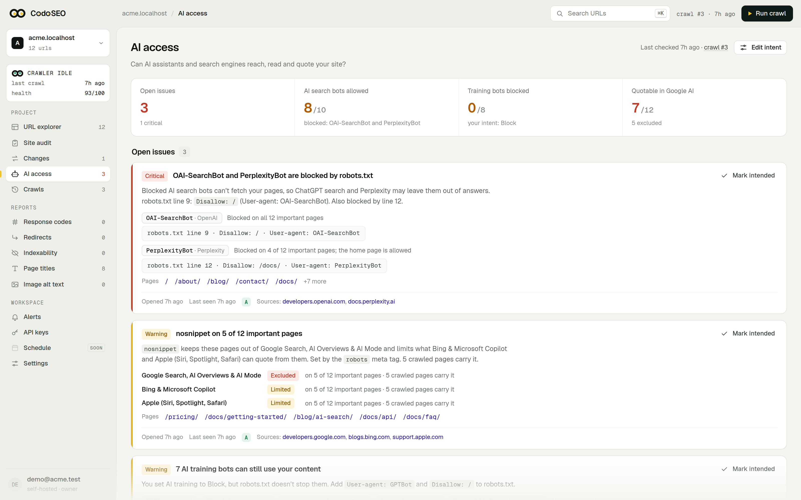
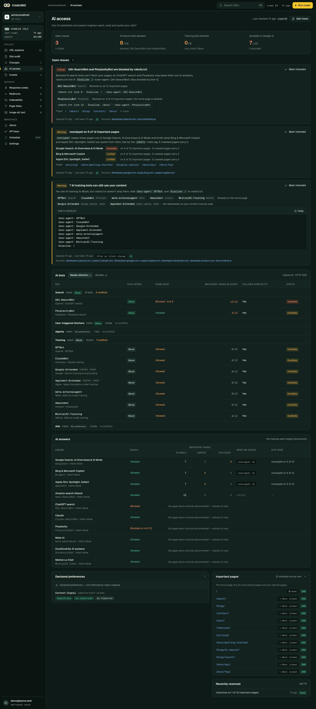
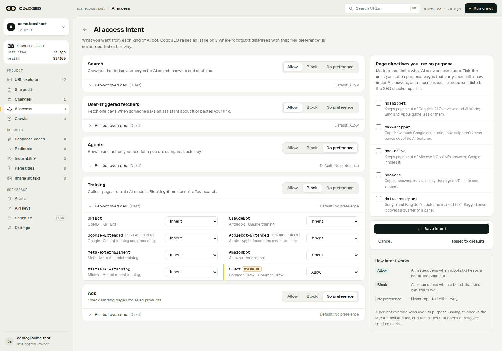
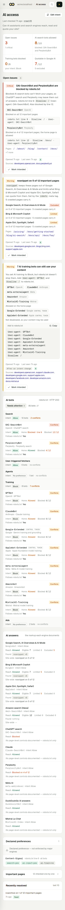
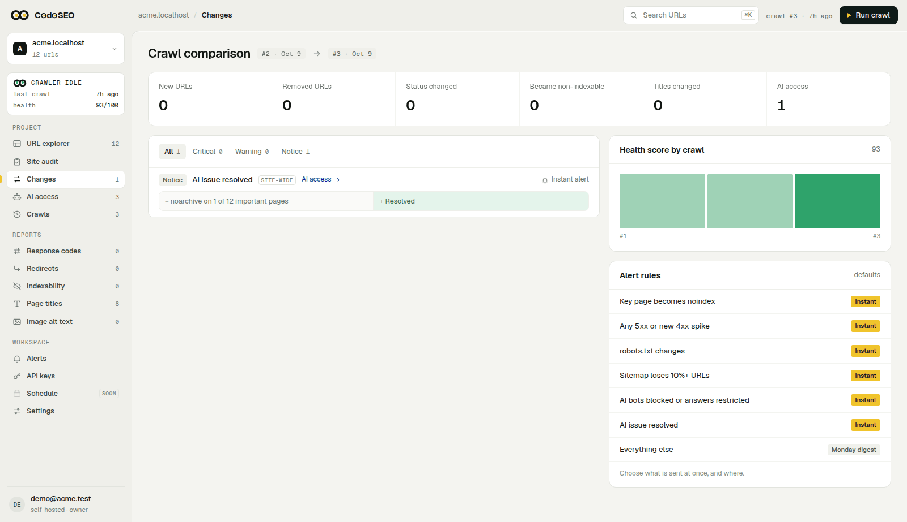
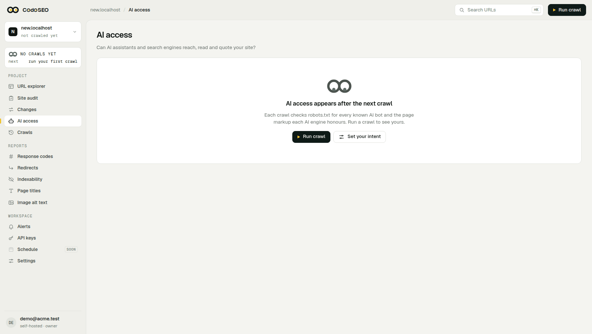
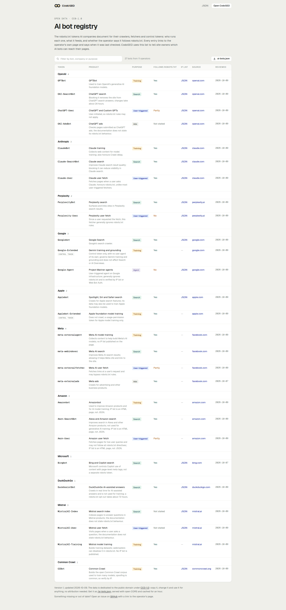

# AI access

AI access monitoring answers one question: can the AI crawlers and answer engines you care about reach your site, and does what they find let your pages appear in their answers? It runs on every crawl, next to the SEO checks, and never touches the health score. There is no composite "GEO score" and no "citation probability": every finding says what was checked, what it rests on and where the operator documents it.



## What is checked

**robots.txt, per bot.** For each bot in the [registry](#the-public-registry) (OpenAI, Anthropic, Perplexity, Google, Apple, Meta, Amazon, Microsoft, DuckDuckGo, Mistral, Common Crawl and more) CodoSEO reads the group of your robots.txt that applies to its product token, applies the longest-match rule the way the operators describe, and records whether the home page and the other important pages are allowed, with the winning rule and its line. Important pages are the home page, the 20 most linked pages and any you star, up to 60. Control tokens such as `Google-Extended` never make requests but still decide what the operator may do, so they are listed too. Applebot, which Apple says follows Googlebot's rules when no group names it, is read that way. A robots.txt that answers 5xx or 429 is its own finding: crawlers are told to stay away until it recovers. One whose redirects never reach a file counts as missing, as RFC 9309 allows.

**Page-level controls, per engine.** For each of ten engines (Google Search, AI Overviews and AI Mode, Bing and Copilot, Apple, Amazon, ChatGPT, Claude, Perplexity, Meta AI, DuckDuckGo, Mistral) CodoSEO reads the controls that engine documents on each important page: the robots meta tag, `X-Robots-Tag` and `data-nosnippet`. Only controls the operator documents count, and only for the engines that honour them: `noarchive` removes a page from Copilot's answers, does nothing to Google's, and for Amazon means only "do not use for model training", so it is not counted there. A page is *eligible*, *limited* (a snippet cap, or a large share of its text under `data-nosnippet`) or *excluded*.

**Robots-only engines.** ChatGPT, Claude, Perplexity, Meta AI, DuckDuckGo and Mistral document no page-level control, so for them a page is always eligible and robots.txt is the only lever; the screen says so instead of implying a clean bill of health.

**Declared preferences, declared, not enforced.** `Content-Signal` and `Content-Usage` lines in robots.txt and response headers, and TDM reservation (`tdm-reservation` meta tag and header, `/.well-known/tdmrep.json`) are listed as the site states them. Nothing enforces them, and CodoSEO does not claim any bot honours them.

## What is not checked yet

- Whether a bot really gets through: **synthetic fetch probes** (fetching a page as each bot and comparing what comes back) arrive later, in milestone B1. Today the verdict is what robots.txt and the page's markup say, not what a firewall or CDN does.
- Whether bots really visit: **log evidence** (which bots crawled you, verified by IP range) arrives later, in C1.
- Whether any engine cites you. CodoSEO reports access, not outcomes.

Every Phase A finding is evidence grade **A**: it rests on something the operator documents, and the finding links to that page.

## Intent

A blocked bot is a mistake or a choice, and only you know which. The intent model tells CodoSEO:

| Purpose | Default |
|---|---|
| AI search (OAI-SearchBot, PerplexityBot, Claude-SearchBot, ...) | Allow |
| User-triggered fetchers (ChatGPT-User, Claude-User, ...) | Allow |
| AI agents | No preference |
| AI training (GPTBot, ClaudeBot, Google-Extended, CCBot, ...) | No preference |
| Ads | No preference |

Set it per purpose, and override single bots, with **Edit intent** on the AI access screen of the web app (`/s/{site}/ai-access/intent`). Severity follows the intent: blocking GPTBot is nothing to report when you have no preference, and a warning or worse when you said you want training crawlers in. A bot you want blocked that can still crawl is reported too. A bot with no preference is never reported either way.

The same form has **Page directives you use on purpose**: tick `nosnippet`, `max-snippet`, `noarchive`, `nocache` or `data-nosnippet` when you set it deliberately, and pages that carry it still show in the AI answers table but raise no issue. `noindex` is not offered: the SEO checks report it.

The CLI and the local MCP server have nowhere to keep your intent, so `codoseo crawl` and `audit_site` judge under the defaults above. The hosted MCP server and the REST API report the incidents drawn under the intent you saved.

## Incidents and alerts

The web app turns findings into incidents that open when a crawl first sees a problem and resolve when a later crawl no longer does. The AI access screen lists the open ones, and the changes page and alerts use five change kinds for them:

| Kind | Meaning |
|---|---|
| `ai_bot_blocked` | Bots you want are kept out by robots.txt, or robots.txt fails |
| `ai_answers_restricted` | Page markup takes pages out of an engine's AI answers |
| `ai_block_not_applied` | A bot you want blocked can still crawl the site |
| `ai_issue_resolved` | An AI access incident is gone |
| `ai_preferences_changed` | Your declared Content-Signal, Content-Usage or TDM preferences changed |

They are in the alert settings grid like any other kind, so email, Slack, Discord and webhook alerts work for them. By default `ai_bot_blocked`, `ai_answers_restricted` and `ai_issue_resolved` alert at once; the other two wait for the Monday digest. An alert whose changes are all AI access ones links to the AI access screen. A crawl that failed on robots.txt is not a finished crawl, so its incident shows on the AI access screen and in alerts, not on the changes page.

**The first check is quiet.** The incidents opened by the first report that could judge them are your baseline: they are listed but write no changes and send no alerts, so turning the feature on (or a site whose first crawls failed) does not fire a storm. Changing your intent re-evaluates quietly the same way. An open incident that gets worse, or names another bot or engine, writes a change again.

**A failing robots.txt is checked twice.** A crawl stopped by a robots.txt that answers 5xx or 429 is retried 15 minutes later, like any failed crawl; the incident is recorded only when the retry fails too, so a short blip says nothing. Its alert then stands in for the generic "couldn't reach your site" one.

**Mark intended** on an incident says "this is what I want" and changes your intent just enough:

- a bot blocked on the home page is set to Block, so you hear if it can crawl again;
- a bot blocked on some pages only is set to No preference (Block would report it as getting in), and so is a bot you wanted blocked that still gets in;
- a page directive such as `nosnippet` joins the directives you use on purpose. The engines' crawlers keep their stance, so robots.txt is still watched for Googlebot, Bingbot and the rest.

It then re-evaluates quietly, the incident resolves as a choice instead of a fix, and the notice says how many issues resolved or opened.

## The public registry

The list of bots behind all this is public at `/ai-bots` (a searchable table) and `/ai-bots.json` (the data), on codoseo.com and on every self-hosted install, no login needed. The data file is licensed **CC0-1.0**: use it for anything, no attribution needed. Each bot has its robots.txt token, operator, product, purpose, whether the operator says it honours robots.txt, the operator's IP-range file and verification hints where published, the source page it was checked against, and the date it was last reviewed.

To propose a change, open a pull request against [SafrowLabs/CodoSEO](https://github.com/SafrowLabs/CodoSEO) editing `crates/geo/data/ai-bots.json`. Cite an operator-owned page in `source_url`, never a third-party directory, and update `last_reviewed` and `updated`. `cargo test -p codoseo-geo` lints the file; the field list is in `crates/geo/data/README.md`.

## Using it

### CLI

```sh
# The registry
codoseo bots
codoseo bots --format json > ai-bots.json   # the file exactly as published

# What robots.txt says to each bot for a path, and the declared preferences
codoseo robots https://example.com/ --path /pricing
```

```
AI bots (path /pricing)
  Token          Operator   Purpose     Verdict
  GPTBot         OpenAI     training    Blocked  line 2
  OAI-SearchBot  OpenAI     search      Allowed
  ChatGPT-User   OpenAI     user fetch  Allowed  may ignore robots.txt
  ...
  Content-Signal (line 6): search=yes, ai-train=no
```

`--format json` adds `bots` (token, operator, purpose, `honours_robots`, `allowed`, `line`, `rule`) and `declared` to the existing fields.

`codoseo crawl` adds an **AI access** section to the table and markdown reports, and an `ai_access` object (`report` and `findings`, judged under the default intent) to the JSON audit. The audit's `format_version` stays 1; older audit files load and diff as before. `--fail-on` looks only at the SEO checks.

### Local MCP

`audit_site` saves the same `ai_access` section as `codoseo crawl` in the cached audit, under the default intent. `check_ai_access` takes a `url` and fetches its robots.txt and the page right now. It returns a short `summary`, every registry bot's verdict for the path (`token`, `operator`, `purpose`, `allowed`, `line`, `rule`), the declared preferences, and for each engine the page's effect (`eligible`, `limited` or `excluded`) with its causes. See [mcp.md](mcp.md).

### Hosted MCP and REST

`get_ai_access` (MCP) and `GET /api/v1/sites/{site}/ai-access` (REST) return the latest report of one of your sites and its open incidents:

```sh
curl -H "Authorization: Bearer cdo_..." https://codoseo.com/api/v1/sites/{site}/ai-access
```

```json
{
  "site_id": "…",
  "checked_at": "2026-10-09T06:12:44Z",
  "crawl_id": "…",
  "robots": { "status": 200, "availability": "ok" },
  "open_incidents": [
    { "id": 12, "kind": "bots_blocked", "subject": "search", "severity": "critical",
      "title": "OAI-SearchBot is blocked by robots.txt", "summary": "…",
      "opened_at": "…", "last_seen_at": "…" }
  ],
  "bots": [
    { "token": "OAI-SearchBot", "operator": "OpenAI", "purpose": "search", "intent": "allow",
      "home_allowed": false, "important_blocked": 3, "important_total": 3, "conflicts": true }
  ],
  "engines": [
    { "id": "google", "name": "Google Search, AI Overviews & AI Mode",
      "eligible": 3, "limited": 0, "excluded": 0, "page_controls": true }
  ],
  "declared": {
    "content_signals": [], "content_usage": [],
    "headers": { "content_signal": [], "content_usage": [], "tdm_reservation": null, "tdm_policy": null },
    "tdm_meta": { "reservation": null, "policy": null }, "tdmrep": null, "home_read": true
  }
}
```

Before a site has a report, `checked_at` is `null` and `note` says it appears after the next crawl. The call counts once against the daily allowance like any other ([api.md](api.md)).

## Screenshots

<table>
  <tr>
    <td width="50%"><a href="images/ai-access/ai-access-light.png"></a><br>The AI access screen</td>
    <td width="50%"><a href="images/ai-access/ai-access-dark.png"></a><br>The same, dark theme</td>
  </tr>
  <tr>
    <td><a href="images/ai-access/intent-light.png"></a><br>The intent form</td>
    <td><a href="images/ai-access/ai-access-mobile.png"></a><br>On a phone</td>
  </tr>
  <tr>
    <td><a href="images/ai-access/changes-light.png"></a><br>AI access changes on the changes page</td>
    <td><a href="images/ai-access/ai-access-empty.png"></a><br>Before the first crawl</td>
  </tr>
  <tr>
    <td><a href="images/ai-access/ai-bots-light.png"></a><br>The public AI bot registry at <code>/ai-bots</code></td>
    <td></td>
  </tr>
</table>
